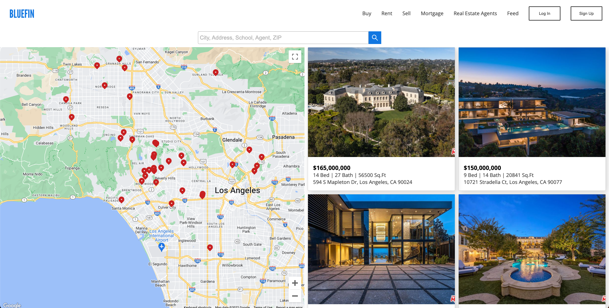

<p align="center">

</p>

<br>
A real estate property finder app using React where users can search active listings by requesting the Zillow API and displaying on an interactive map provided by the Google Maps API.
<br>
[Check demo here.](https://bluefin.vercel.app/)

<br>
<br>

<p align="center">

</p>

<p align="center">

</p>

<br>

## Description

### React

I built the frontend of this application using React in order to design and implement resuable components. I also used libraries such as React Hooks to declare state in components and React Router to configure routes and navigation. Using React DOM, I used this opporuntity to create a portal and a modal component when a user clicks on a specific listing card.

<br>

<p align="center">

</p>
<br>

### APIs

<p> This application utilizes two third-party APIs, Google Maps and the Zillow API. When a user submits a query, the app first calls the Zillow API in order to get all the available listings. Once the listings are received, the data is then passed onto the Google Maps component rendering each listing on the map based on their coordinates. The listings data are also used to display a list of the listing cards. <p/>
<br>

### CSS

For this application, I utilized pure CSS to style the components instead of using a framework I am fond of such as Tailwind CSS. Through this exercise, I brushed up on CSS fundamentals and responsive designs implementing media queries.
<br>

## Getting Started

### Clone This Repository

```bash
git clone https://github.com/andrewcpark/bluefin.git
```

### Install Dependencies

```bash
npm install
```

### Run Application

```bash
npm start
```
